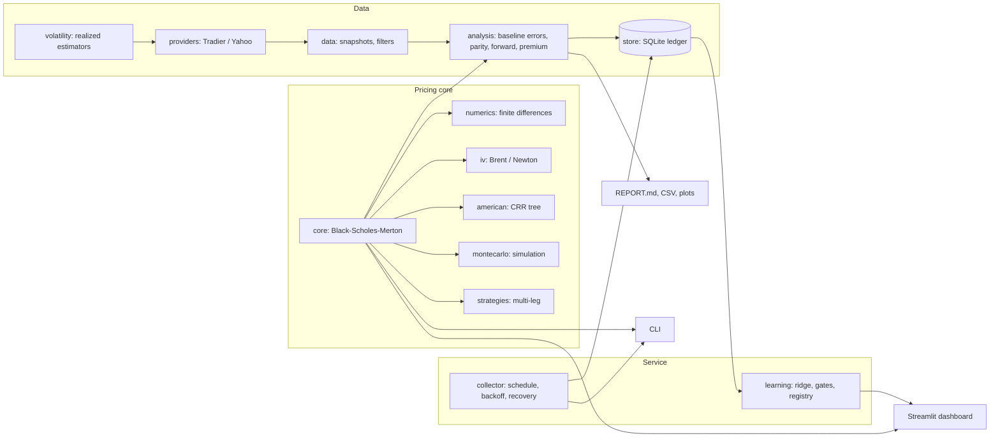

# Options Analysis Engine

[](https://github.com/omjoshi0925/options-analysis-engine/actions/workflows/tests.yml)


A research toolkit for option pricing, continuous options-chain collection,
and chronological evaluation of a learned volatility model. Every number it
reports is checked against an independent method, every quote it stores is
checksummed, and every model it promotes has to beat a baseline on sessions
it never saw.

The mathematical baseline is Black-Scholes-Merton. A binomial tree prices
American exercise on the same inputs, Monte Carlo simulation checks the closed
form statistically, and a ridge model learns a volatility adjustment from
earlier sessions that is evaluated on later ones. More data creates
opportunities to improve the model; improvement is measured and gated, never
assumed.

## What version 3.1 does

| Area | Capability |
|---|---|
| Pricing | European calls and puts with continuous dividends, exact boundary prices, analytical Greeks verified by finite differences, Brent/Newton implied volatility with full diagnostics |
| American exercise | Cox-Ross-Rubinstein tree pricing both exercise styles on one lattice: early-exercise premium, discretization error, exercise boundary, tree Greeks |
| Verification | Independent risk-neutral quadrature and antithetic Monte Carlo with a reported standard error and z-score |
| Baseline volatility | Close-to-close, Parkinson, Garman-Klass, Rogers-Satchell, and Yang-Zhang realized-volatility estimators, selectable per configuration |
| Chain diagnostics | Independent-baseline errors by moneyness, tenor, IV, and liquidity; smiles and surfaces; parity intervals; implied forward, rate, and yield from put-call parity; early-exercise premium per quote |
| Strategies | Fourteen multi-leg presets with exact breakevens and bounds, closed-form marks, aggregated Greeks, and payoff figures |
| Collection | Regular-session polling with holiday, DST, and early-close handling; Tradier production adapter with quote timestamps; Yahoo research snapshots; hard deadlines, persisted backoff, process locks, orphan recovery, quarantine |
| Storage | Immutable checksummed snapshots plus a SQLite observation ledger with deduplication and recorded quality reasons |
| Learning | Rolling chronological training with embargo gaps, validation-selected regularization, held-out gates against the baseline and the incumbent, checksummed model versions, rollback, and batch monitoring |
| Interfaces | Streamlit dashboard, a CLI for one-shot pricing, IV inversion, strategies, and the collection workflow, plus Docker and systemd deployment |

## Quick start

Python 3.10 or newer. Run every command from the repository root.

```bash
make venv && make test
```

```bash
make app
```

Without make: create `.venv`, `pip install -r requirements.txt`, then
`python -m pytest -q` and `python -m streamlit run BSM_streamlit.py`.

One-shot pricing, IV inversion, and a strategy summary as JSON:

```bash
source .venv/bin/activate && python -m options_engine price --S 100 --K 105 --days 45 --r 0.04 --sigma 0.25 --q 0.01 --type put --paths 200000
```

```bash
source .venv/bin/activate && python -m options_engine iv --price 4.20 --S 100 --K 100 --days 30 --r 0.04
```

```bash
source .venv/bin/activate && python -m options_engine strategy --preset iron_condor --S 100 --days 30 --r 0.04 --sigma 0.2 --width 5 --plot results/condor.png
```

An offline, clearly labelled synthetic demonstration of the full chain analysis:

```bash
make demo
```

## How the pieces fit



## Continuous collection and training

The Tradier adapter uses the production market-data API, which requires your
own account token and data access; it calls market-data endpoints only.
Create a configuration (the command refuses to overwrite an existing file),
edit the tickers, risk-free rate, dividend-yield scenarios, and optionally the
`baseline_estimator`, then save the token with a hidden prompt and start the
macOS service:

```bash
source .venv/bin/activate && python -m options_engine init-live --provider tradier --config config/collector.json
```

```bash
bash scripts/set_tradier_token.sh && bash scripts/collector_service.sh start
```

The collector runs at login, restarts after failures, waits outside regular
sessions, and never fabricates quotes to fill downtime. For a host that stays
on, use the Docker image or the systemd unit described in
[deployment](docs/DEPLOYMENT.md). Yahoo works without a token but is
research-only: it lacks reliable bid/ask timestamps, so its rows are archived
and excluded from strict-quality training.

```bash
source .venv/bin/activate && python -m options_engine init-live --provider yahoo --config config/yahoo-collector.json && python -m options_engine collect --config config/yahoo-collector.json
```

See [continuous collection](docs/CONTINUOUS_COLLECTION.md) for scheduling,
recovery, logs, storage, and provider limits.

## What gets trained

The learned target is log(calculated IV / independent baseline volatility).
Features are moneyness, time, baseline volatility, rate and yield inputs,
option type, and asset identity. Current option prices, provider IV, solved
IV, and target-derived Greeks are excluded from the input features.

Defaults require 300 qualifying observations over at least 12 completed
trading sessions. The last two sessions are untouched test data, the two
before them select the regularization, and one-session gaps separate both
boundaries. Promotion requires at least 2% lower spot-normalized RMSE than the
baseline on validation and test, at least 2% improvement over the active
model on test, no material asset-level regression, no material drop in
within-spread coverage, and no strike-shape violations at the observed test
nodes. Rejected candidates leave the active model unchanged, and later
attempts need fresh test sessions. This estimates contemporary option values
on later observations; it is not a return-forecasting system. See
[learning methodology](docs/LEARNING.md).

## Commands

| Command | Purpose |
|---|---|
| `price` | Closed-form prices, Greeks, American tree comparison, optional Monte Carlo check |
| `iv` | Invert implied volatility from a price with solver diagnostics |
| `strategy` | Breakevens, bounds, mark, and Greeks for a preset multi-leg position |
| `demo` | Explicitly synthetic offline demonstration of the chain analysis |
| `fetch` / `analyze` | One-shot Yahoo acquisition and checksum-verified snapshot analysis |
| `init-live` | Create an editable collector configuration |
| `collect` | Continuous collection; `--once` checks one cycle, `--probe` acquires once outside market hours |
| `status` | Counts, training readiness, heartbeat, models, recent failures |
| `train` | Evaluate a candidate from complete prior sessions |
| `ingest` | Add an existing checksum-verified snapshot |
| `score-snapshot` | Compare a later snapshot with the active model and baseline |
| `select-model` | Return to the baseline or roll back to a promoted model |

Live state lives under `data/live/` by default: `snapshots/`, `audits/`,
`observations.sqlite3`, `models/`, `evaluations/`, monitoring, and status and
log files. These files and local credentials and configs are excluded from
Git; back up the data folder regularly.

## Repository layout

```
options_engine/    package: pricing core, diagnostics, collection, learning
BSM_streamlit.py   dashboard entry point
tests/             offline test suite: reference values, fixtures, dashboard AppTest
docs/              methodology, learning, collection, deployment, validation
examples/          synthetic validation outputs and recorded provider failures
config/            example collector configurations; local configs are ignored
scripts/           macOS service and token helpers
deploy/, docker/   systemd unit and container entrypoint
```

## Documentation

- [Mathematics and empirical methodology](docs/METHODOLOGY.md)
- [Learned volatility model and evaluation](docs/LEARNING.md)
- [Continuous market-data collection](docs/CONTINUOUS_COLLECTION.md)
- [Deployment on an always-on host](docs/DEPLOYMENT.md)
- [Validation record](docs/VALIDATION.md) and [requirements coverage](docs/PROJECT_COVERAGE.md)
- [Contributing](CONTRIBUTING.md) and [security policy](SECURITY.md)

## Status

The included `examples/validation/` results are synthetic demonstrations.
**No market-trained model or successful live collection is claimed in this
release.** The runtime collects and trains after you configure and start it
with a working provider. License details are in [LICENSE.txt](LICENSE.txt)
and [THIRD_PARTY_NOTICES.md](THIRD_PARTY_NOTICES.md).
